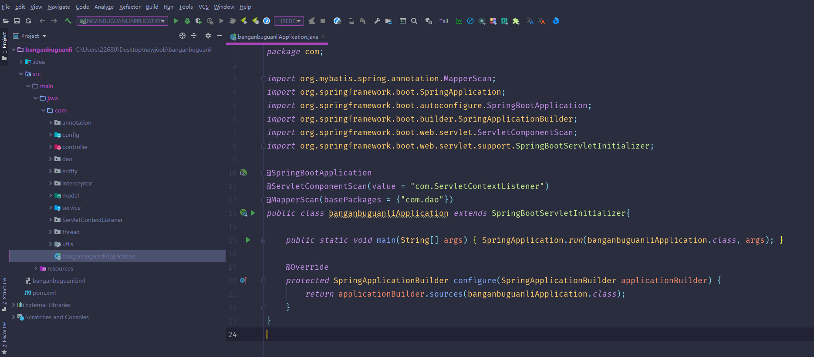
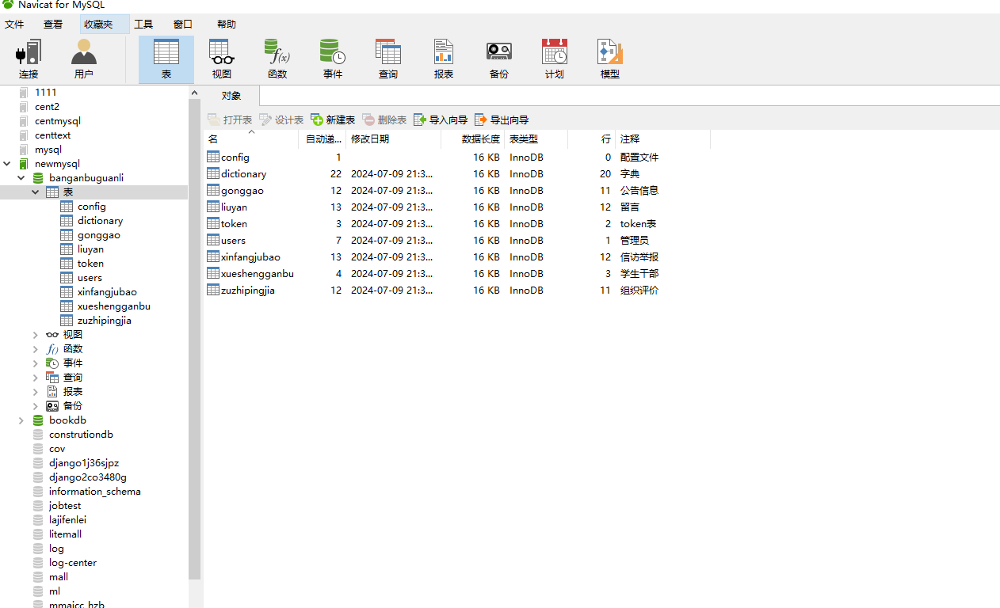
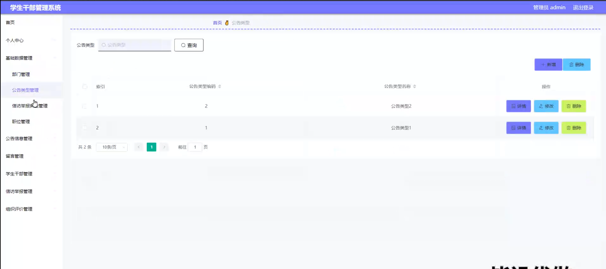
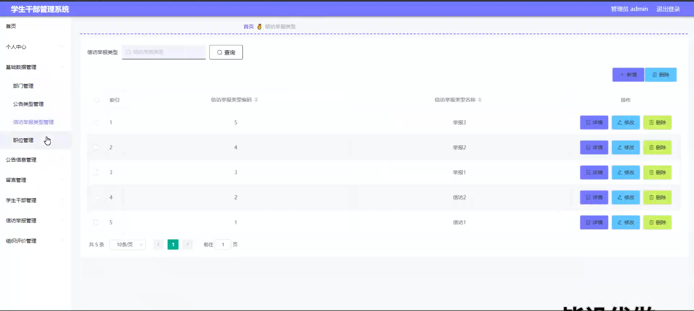
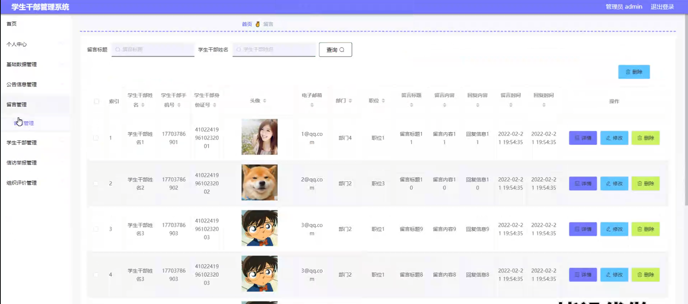
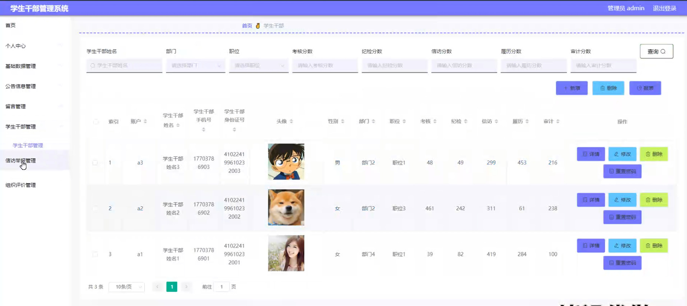
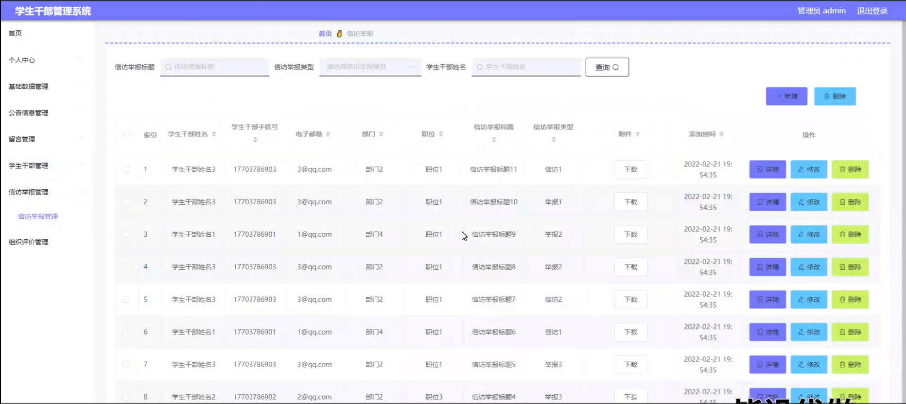
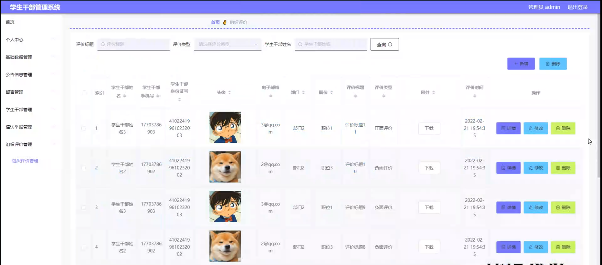
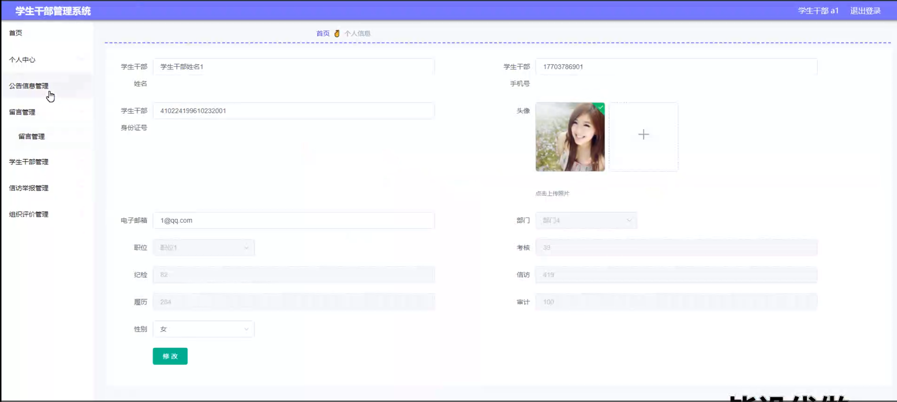
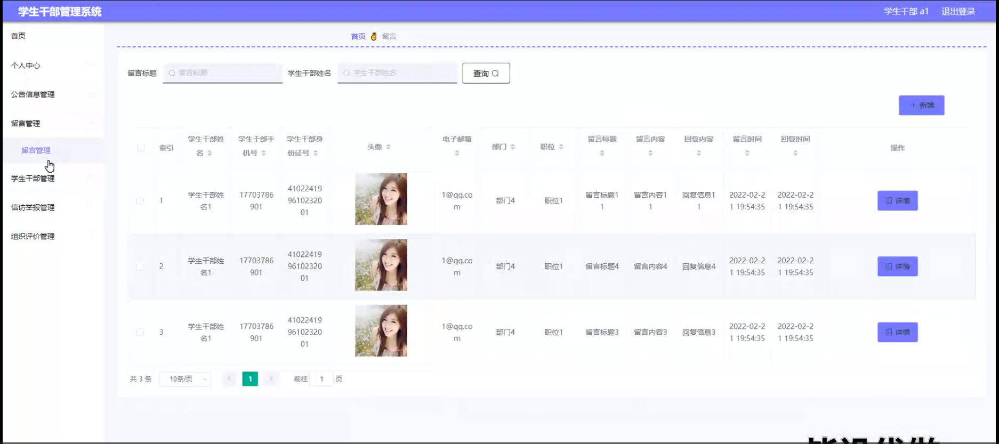

# 基于springboot的学生干部管理系统

#### 介绍

在学校的学生管理工作中，学生干部发挥着重要的桥梁和纽带作用。为了更高效、规范地管理学生干部队伍，提高学生工作的质量和效率，我们开发了这个基于 Spring Boot 的学生干部管理系统。该系统旨在为学校管理人员和学生干部提供一个便捷、集成的管理平台，实现学生干部管理的信息化、科学化。

#### 技术栈

后端技术栈：Springboot+Mysql+Maven

前端技术栈：Vue+Html+Css+Javascript+ElementUI

开发工具：Idea+Vscode+Navicate

#### 系统功能介绍

（一）管理员角色  
个人中心：管理员在此可查看和修改个人信息，如联系方式、密码等，同时接收系统通知和重要消息。  
基础数据管理  
部门管理：对学校内的学生组织部门进行创建、编辑和删除，明确各部门的职责和权限范围。  
公告类型管理：设置不同类型的公告，如活动通知、表彰公告、纪律通告等，以便分类发布和管理。  
信访举报类型管理：定义信访举报的类别，如违纪行为举报、工作作风投诉等，便于分类处理和统计。  
职位管理：设定学生干部的职位名称、职责描述和任职要求，为选拔和任用提供标准。  
公告信息管理：发布、编辑和删除各类公告信息，确保学生干部和广大学生及时了解学校的重要通知和工作安排。  
留言管理：查看和回复学生干部及学生的留言，及时解决他们的问题和关切，促进沟通交流。  
学生干部管理：全面管理学生干部的档案信息，包括基本资料、任职履历、考核成绩等。可以进行学生干部的选拔、任免和调配操作。  
信访举报管理：接收和处理学生的信访举报，对举报内容进行核实和处理，维护学校的纪律和公正。  
组织评价管理：对学生干部所在的组织或团队进行绩效评估和综合评价，为改进工作提供依据。  

（二）学生干部角色  
个人中心：同管理员的个人中心功能相似，学生干部可修改个人信息。  
公告信息管理：查看学校发布的各类公告，了解学校的最新动态和工作要求。  
留言管理：向管理员留言反馈问题或提出建议，与其他学生干部进行交流。  
学生干部管理：查看自身的干部档案信息，了解任职情况和考核结果。  
信访举报管理：若发现违规违纪等问题，可进行信访举报操作。  
组织评价管理：参与所在组织的评价工作，提供自我评价和对组织的意见。  

#### 系统作用

学生干部管理系统的主要作用包括：  

提升管理效率： 为管理员提供全面的管理工具，帮助高效管理学生干部信息、公告、留言、信访举报和组织评价，确保信息的准确性和及时性。  
优化学生干部管理： 通过系统化的学生干部管理和职位分配，帮助学校更好地选拔和管理学生干部，提升管理水平和学生干部的工作积极性。  
促进信息透明化： 提供便捷的查询和管理功能，使学生干部可以随时查看个人信息、公告和留言，提升信息透明度。  
简化信访举报流程： 通过信访举报管理模块，简化信访举报的提交和处理流程，提高举报的处理效率和结果反馈。  

#### 系统功能截图

代码结构

数据库表

登录

基础数据管理的公告类型

基础数据类型的信访举报类型管理

留言管理

学生干部管理

信访举报管理

组织评价管理

学生干部端个人信息

学生干部端留言管理

#### 总结

基于 Spring Boot 的学生干部管理系统通过清晰的角色划分和丰富的功能模块，为学校的学生干部管理工作带来了全新的方式和效率。管理员能够实现全面、精细的管理，学生干部能够更好地履行职责和参与管理过程。该系统有助于提升学校学生工作的质量和水平，营造更加积极、有序的校园环境。

#### 使用说明

创建数据库，执行数据库脚本 修改jdbc数据库连接参数 下载安装maven依赖jar 启动idea中的springboot项目

后台登录页面
http://localhost:8080/banganbuguanli/admin/dist/index.html

管理员				账户:admin 	密码：admin
学生干部				账户:a1 		密码：123456
学生干部				账户:a2 		密码：123456
学生干部				账户:a3 		密码：123456